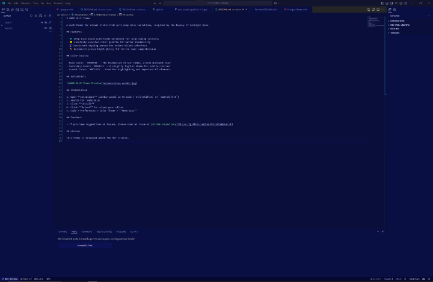

# ANNO BLUE Theme

This is un official VSC theme inspired by Director Hideaki Annno's blue color.  
Mr. Anno perform briliant blue color usage in his films.
I truely respect his work a lot.

## Features

- 💠 Deep blue-based dark theme optimized for long coding sessions
- 🎨 Carefully selected color palette for better readability
- 🖥 Consistent styling across the entire VSCode interface
- ⚡ Optimized syntax highlighting for better code comprehension

## Color Palette

- Main Color: `#0A0E3B` - The foundation of our theme, a deep midnight blue
- Secondary Color: `#090F43` - A slightly lighter shade for subtle contrast
- Accent Color: `#0C1154` - Used for highlighting and important UI elements

## Screenshots

## Installation

1. Open **Extensions** sidebar panel in VS Code (`Ctrl+Shift+X` or `Cmd+Shift+X`)
2. Search for `ANNO BLUE`
3. Click **Install**
4. Click **Reload** to reload your editor
5. Code > Preferences > Color Theme > **ANNO BLUE**

## Feedback

- If you have suggestions or issues, please open an issue at [GitHub repository](https://github.com/KunihiroS/ANNO-BLUE)

## License

This theme is released under the MIT License.
